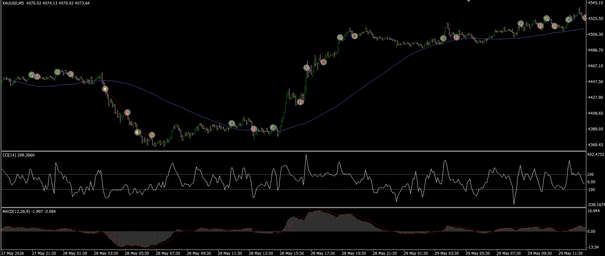
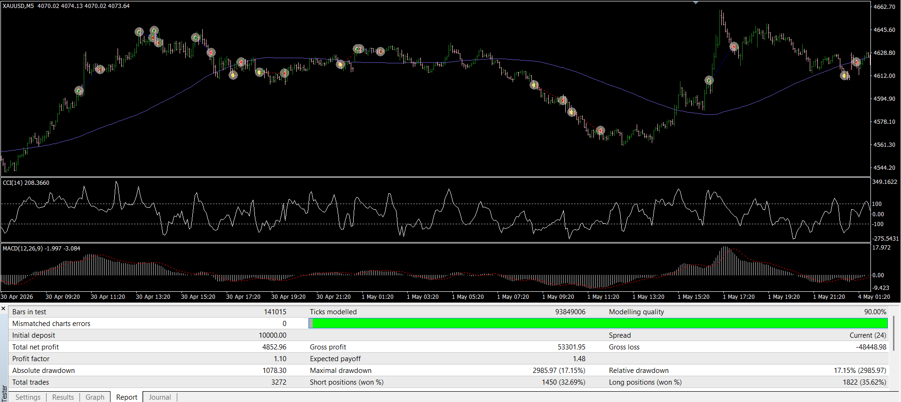

# MACD CCI Trend Filter EA MT4

An MQL4 Expert Advisor that combines MACD crossover signals, CCI confirmation, and SMA trend filtering to automate trading decisions on MetaTrader 4.

The EA uses technical indicator conditions to identify potential BUY and SELL opportunities and manages trades automatically based on signal reversal conditions.

## Features

- MACD crossover based entry signals
- CCI confirmation filter
- SMA trend direction filter
- Automatic BUY and SELL execution
- Configurable lot size
- Signal-based trade exit
- Magic Number based order management
- Prevents multiple simultaneous positions

## Trading Logic

### BUY Entry

A BUY position is opened when:

- MACD main line crosses above the signal line
- CCI value confirms bullish momentum (`CCI > 100`)
- Price is above the selected SMA trend filter

### SELL Entry

A SELL position is opened when:

- MACD main line crosses below the signal line
- CCI value confirms bearish momentum (`CCI < -100`)
- Price is below the selected SMA trend filter

### Exit Logic

Open positions are closed when the MACD crossover generates an opposite signal.

## Technologies

- MQL4
- MetaTrader 4
- Technical Indicators
- Expert Advisor Development

## Screenshot

## Backtest Results

Historical backtest performed for evaluation purposes.

Test Settings:

- Initial Deposit: $10,000
- Test Period: 2 years
- Total Trades: 3,272
- Modeling Quality: 90%
- Spread: Current (23)

Results:

- Net Profit: $5,016.56
- Profit Factor: 1.10
- Expected Payoff: $1.53
- Max Drawdown: 16.91%

> Backtest results are for demonstration purposes only and do not guarantee future performance.

## Installation

1. Copy `EA_MACD_CCI.mq4` into:
MQL4/Experts/

2. Open MetaEditor and compile the file.

3. Attach the EA to a MetaTrader 4 chart.

## Project Type

Personal MQL4 Development Project

## Author

Leyla Khojasteh
